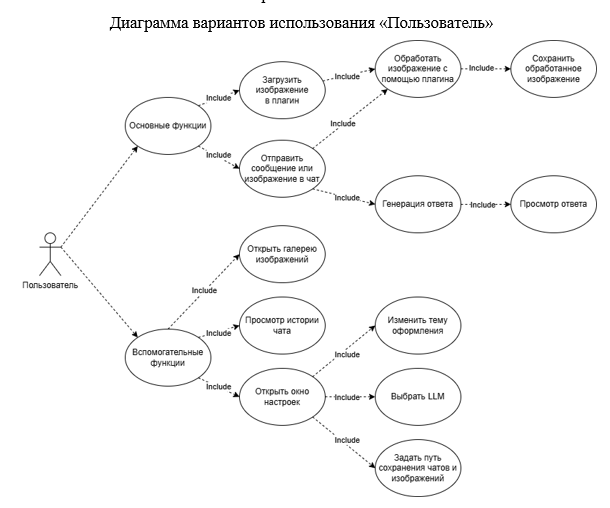
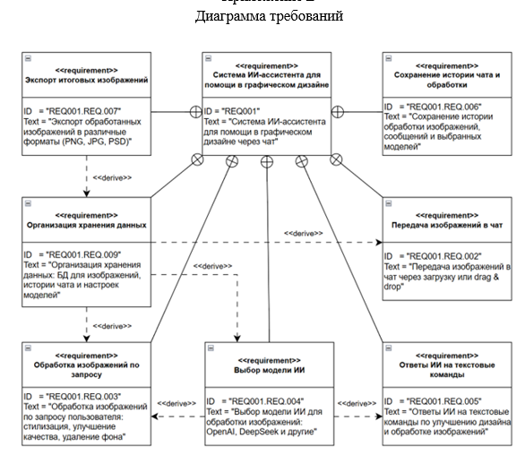
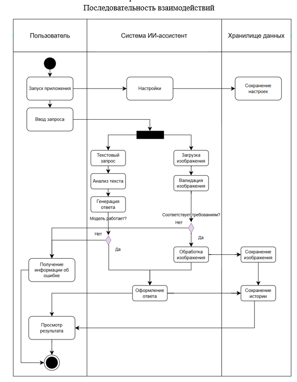
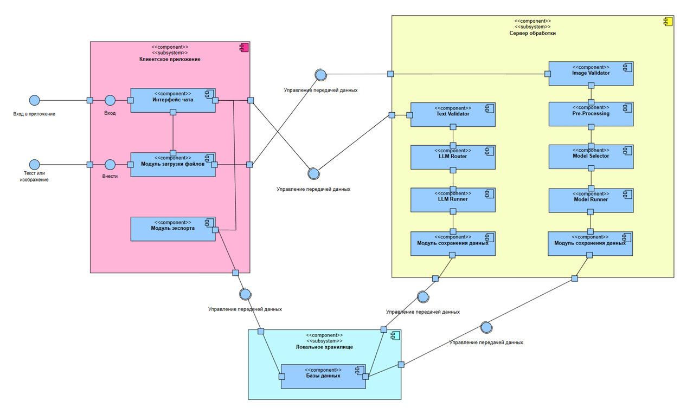

# Русский (RU):

---

# AI Design Assistant

**AI Design Assistant** — это десктопное приложение на Python, которое помогает графическим дизайнерам взаимодействовать с ИИ в формате диалога и выполнять обработку изображений с помощью плагинов. Приложение сочетает в себе мощь языковых моделей (OpenAI, DeepSeek, Pangea, Qwen и локальные LLM) с интуитивным PyQt6-интерфейсом и модулями обработки изображений.

---

## 🚀 Основные возможности

* 💬 **Диалог с ИИ** — общение с LLM через удобное текстовое поле с drag & drop и прикреплением изображений.
* 🧩 **Плагины** для:

  * удаления фона (`rembg`)
  * апскейлинга (`SwinIR`, `Real-ESRGAN`, `Remacri`)
  * конвертации форматов
  * обрезки и масштабирования
  * сжатия изображений
* 🖼️ **Галерея изображений**, связанная с текущей сессией
* 💾 **Автосохранение чатов и изображений** в локальной файловой структуре
* 🖥️ **Поддержка локальных моделей** на `transformers` и `onnxruntime`
* 🎨 **Темы оформления**, поддержка светлой и тёмной темы
* 🧪 **Тесты** (unit + UI) и структура, готовая к CI

---

## 🛠️ Установка

### 📦 Системные требования

* Python **3.11–3.12**
* Windows / Linux / macOS
* GPU (опционально, для ускорения обработки изображений)

### ⚙️ Установка с помощью Poetry

```bash
git clone https://github.com/Claritty01/AI-Design-Assistant.git
cd AI-Design-Assistant
poetry install
poetry run python -m ai_design_assistant
```

### 🐍 Или через pip + requirements.txt

```bash
git clone https://github.com/Claritty01/AI-Design-Assistant.git "Укажите свой путь"
python -m venv ./venv
pip install -r requirements.txt
python -m ai_design_assistant
```

---

## 🧱 Структура проекта

```
ai_design_assistant/
│
├── api/           # Интеграция с LLM (OpenAI, локальные модели и пр.)
├── core/          # Базовая логика: сессии, модели, настройки
├── plugins/       # Плагины обработки изображений
├── resources/     # Иконки и стили
├── ui/            # PyQt6 GUI: окна, панели, виджеты
├── data/          # Локальные чаты и изображения
└── __main__.py    # Точка входа в приложение
```

---

## 🧠 Поддерживаемые LLM

* ✅ OpenAI (GPT-4, GPT-3.5)
* ✅ DeepSeek
* ✅ Pangea-7B (через `transformers`)
* ✅ Qwen2.5-VL (локально)
* ✅ Любые другие совместимые модели через `ModelBackend`

---

## 📸 Пример плагинов

Плагин `EnhancePlugin` позволяет выбирать модель улучшения (SwinIR, ESRGAN и пр.) и обрабатывать изображение по частям. Поддерживается:

* загрузка через галерею или drag & drop
* отслеживание прогресса
* сохранение результата в общую галерею

---

## 🧪 Тестирование

```bash
pytest tests/
```

Покрытие: unit-тесты логики, интеграционные тесты UI (через `pytest-qt`).


## Диаграммы






---

#   English (ENG):

---

# AI Design Assistant

**AI Design Assistant** is a desktop application built with Python and PyQt6 that helps graphic designers interact with large language models (LLMs) and perform image processing tasks through a plugin system. It combines modern AI models (OpenAI, DeepSeek, Pangea, Qwen, and local models) with a user-friendly interface and practical visual tools.

---

## 🚀 Features

* 💬 **Chat with AI** — dialog interface with drag & drop support and image attachments
* 🧩 **Image processing plugins**, including:

  * background removal (`rembg`)
  * image enhancement (e.g. `SwinIR`, `Real-ESRGAN`, `Remacri`)
  * format conversion
  * cropping and resizing
  * image compression
* 🖼️ **Image gallery** tied to each chat session
* 💾 **Automatic session and image saving** to local folders
* 🖥️ **Local model support** via `transformers` or `onnxruntime`
* 🎨 **Light/dark theme support**
* 🧪 **Unit and UI test suite**

---

## 🛠️ Installation

### 📦 Requirements

* Python **3.11–3.12**
* Windows / Linux / macOS
* GPU recommended for enhanced image processing speed

### ⚙️ Install with Poetry

```bash
git clone https://github.com/Claritty01/AI-Design-Assistant.git
cd AI-Design-Assistant
poetry install
poetry run python -m ai_design_assistant
```

### 🐍 Or using pip

```bash
git clone https://github.com/Claritty01/AI-Design-Assistant.git "Enter your path"
python -m venv ./venv
pip install -r requirements.txt
python -m ai_design_assistant
```

---

## 🧱 Project Structure

```
ai_design_assistant/
│
├── api/           # LLM backends (OpenAI, DeepSeek, Qwen, etc.)
├── core/          # Core logic: chat sessions, routing, settings
├── plugins/       # Image processing plugins
├── resources/     # Icons, themes, stylesheets
├── ui/            # PyQt6 GUI components
├── data/          # Saved chat sessions and image folders
└── __main__.py    # Application entry point
```

---

## 🧠 Supported LLMs

* ✅ OpenAI (GPT-3.5 / GPT-4)
* ✅ DeepSeek
* ✅ Pangea-7B (via `transformers`)
* ✅ Qwen2.5-VL (local inference)
* ✅ Any custom `ModelBackend` you register

---

## 🖼 Example Plugin: Enhance

The `EnhancePlugin` allows the user to select enhancement models like SwinIR or ESRGAN, and apply them to images either as a whole or in tiles with progress tracking.

Features include:

* Load image from chat or gallery
* Direct drag & drop support
* Output saved to the session’s gallery

---

## 🧪 Testing

```bash
pytest tests/
```

Test suite includes both unit logic and GUI integration using `pytest-qt`.


